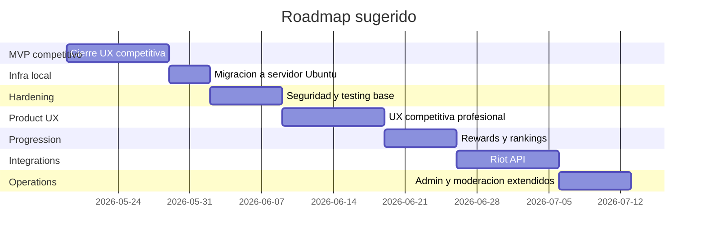

# Cronograma de Avance

## Objetivo
Definir una hoja de ruta ejecutable para evolucionar la plataforma desde el MVP tecnico actual hacia una version operativa mas completa, lista para pruebas reales en servidor local.

## Estado actual
Ya completado:
- Documentacion funcional y tecnica base.
- Monorepo con frontend, backend, shared y Prisma.
- Modelo de datos inicial y migracion base.
- Auth con JWT y roles.
- Teams, Spaces y Tournaments base.
- Registrations, check-in inicial y bracket basico.
- Matches, resultados, disputas y auditoria.
- UX inicial de dashboard, detalle de torneo y match room.

## Cronograma recomendado

### Fase A. Cierre del MVP competitivo
Duracion estimada: 1 a 2 semanas

Objetivos:
- Completar experiencia competitiva principal.
- Dejar el flujo listo para pruebas end-to-end cuando PostgreSQL este activo.

Entregables:
- Confirmacion de resultados desde frontend.
- Check-in visual y estados mas claros.
- Detalle de teams y spaces.
- Mejoras de permisos y flujo de roster.
- Formularios UX mas consistentes.

### Fase B. Pruebas integradas en servidor local
Duracion estimada: 2 a 4 dias

Objetivos:
- Migrar la app al servidor Ubuntu.
- Validar que backend, frontend y PostgreSQL funcionen de punta a punta.

Entregables:
- Base de datos migrada.
- Seed aplicado.
- Flujo real probado.
- Correccion de issues de entorno.

### Fase C. Hardening tecnico
Duracion estimada: 1 semana

Objetivos:
- Reducir deuda tecnica antes de sumar integraciones externas.

Entregables:
- Rate limiting.
- Mejor manejo de errores.
- Validaciones reforzadas.
- Logs mas consultables.
- Tests de integracion basicos.

### Fase D. UX profesional competitiva
Duracion estimada: 1 a 2 semanas

Objetivos:
- Llevar la experiencia a un nivel mas cercano a una plataforma profesional de eSports.

Entregables:
- Bracket visual mejorado.
- Match room mas rica.
- Empty states, loading states y feedbacks pulidos.
- Navegacion mas orientada a jugador, organizador y moderador.
- Consistencia visual mas fuerte.

### Fase E. Rewards y rankings
Duracion estimada: 1 semana

Objetivos:
- Introducir progresion interna no monetaria.

Entregables:
- Rankings iniciales.
- Rewards internas.
- Badges o XP.
- Historial competitivo resumido.

### Fase F. Integracion Riot API
Duracion estimada: 1 a 2 semanas

Objetivos:
- Conectar cuentas de Riot de forma segura desde backend.

Entregables:
- Servicio real de Riot API.
- Variables de entorno validadas.
- Vinculacion de Riot ID.
- Verificacion de cuenta.
- Base para automatizacion futura de validacion competitiva.

### Fase G. Panel admin y moderacion extendidos
Duracion estimada: 1 semana

Objetivos:
- Mejorar operacion diaria y trazabilidad.

Entregables:
- Filtros en auditoria.
- Cola de disputas mas util.
- Gestion de usuarios y roles.
- Estados administrativos de entidades.

### Fase H. Premios futuros y compliance
Duracion estimada: posterior al MVP operativo

Objetivos:
- Preparar modulo de premios monetarios de torneos sin tocar apuestas.

Entregables:
- Wallet de premios mejor definida.
- Ledger de payouts.
- KYC y aprobacion manual.
- Auditoria financiera separada.

## Vista tipo timeline

## Prioridad real recomendada
Orden recomendado:
1. UX competitiva y flujo real del torneo.
2. Migracion a servidor y pruebas integradas.
3. Hardening tecnico.
4. Riot API.
5. Rewards, rankings y operacion avanzada.

## Riesgos del cronograma
- El servidor apagado puede desplazar la validacion real.
- La integracion Riot depende de acceso, credenciales y politicas del proveedor.
- La parte monetaria futura puede requerir rediseños legales y operativos.

## Recomendacion operativa
Mientras el servidor siga apagado, conviene invertir todo el tiempo en:
- cerrar flujo UX,
- endurecer permisos y reglas,
- dejar listas pruebas y documentacion,
- y preparar el modulo Riot sin activarlo aun.
