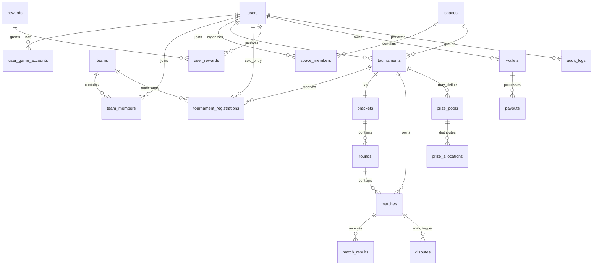
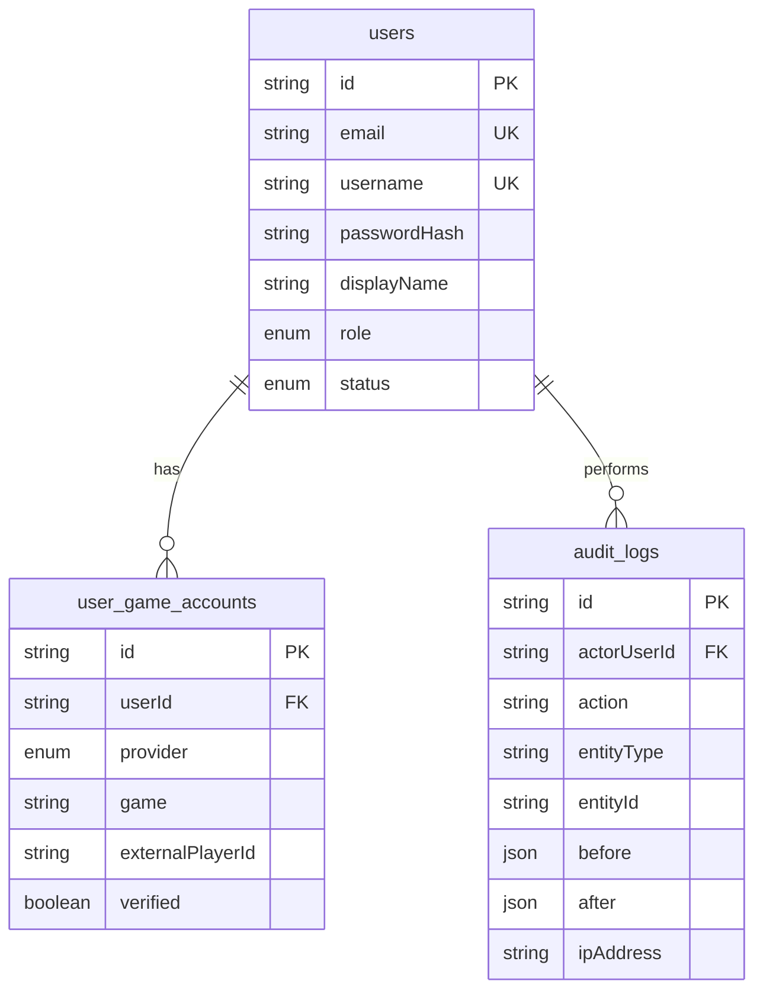
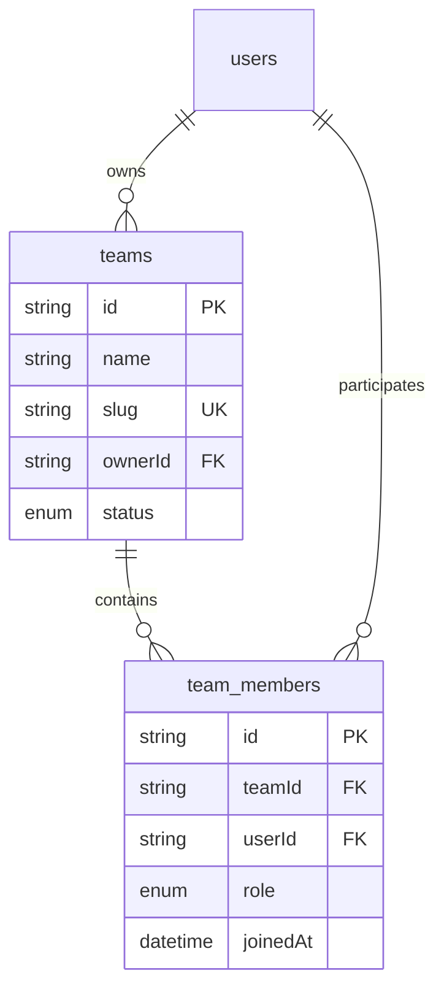
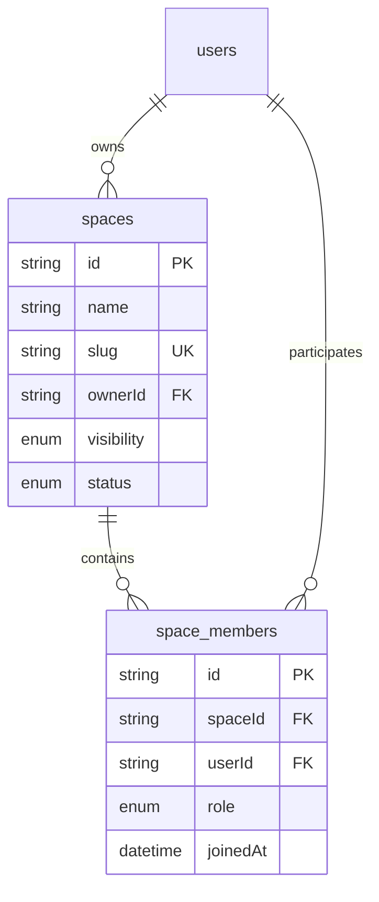
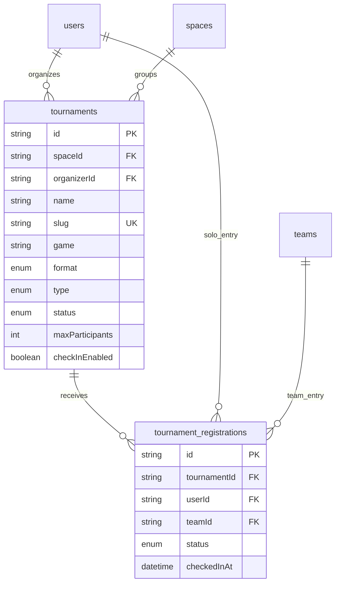
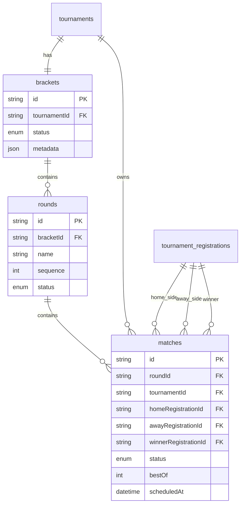
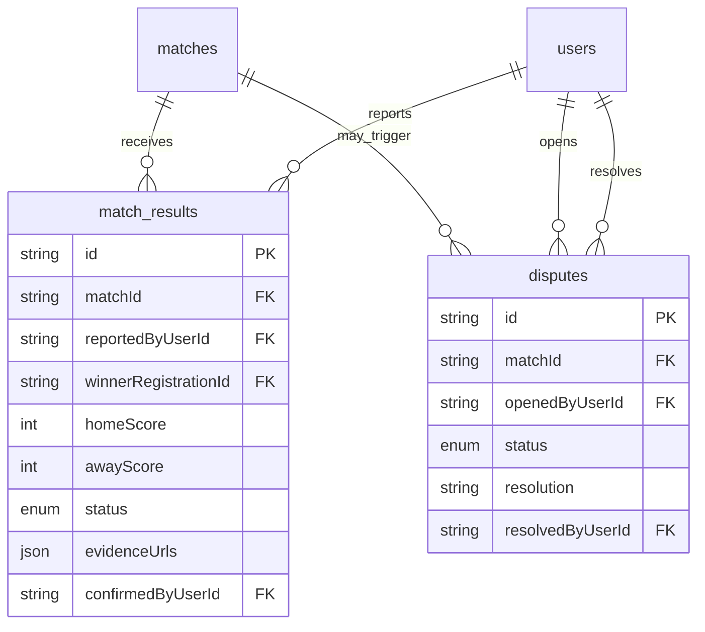
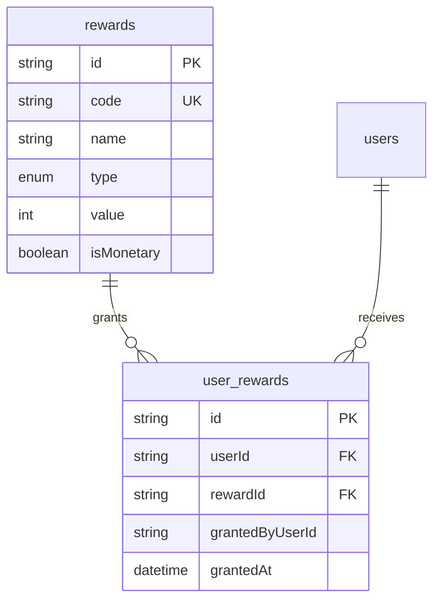
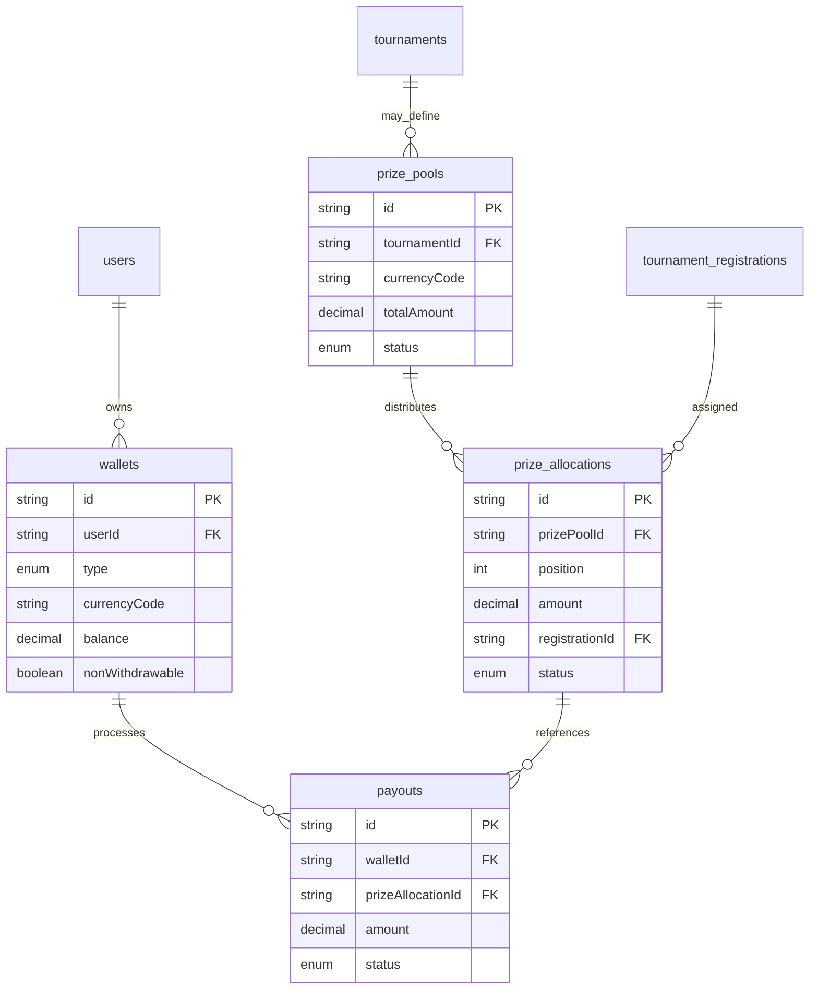

# DB Schema Visual

## Objetivo
Este documento resume visualmente la estructura actual de base de datos del proyecto para facilitar revision tecnica, planeacion de nuevas migraciones y posterior despliegue en servidor Ubuntu con PostgreSQL.

## Vista global

## Modulo 1. Identidad y acceso
Tablas:
- `users`
- `user_game_accounts`
- `audit_logs`

Proposito:
- Gestionar usuarios, roles y estado de acceso.
- Preparar vinculacion futura con cuentas de juego.
- Registrar trazabilidad de acciones criticas.

## Modulo 2. Equipos
Tablas:
- `teams`
- `team_members`

Proposito:
- Crear equipos competitivos.
- Gestionar owner, capitanes, miembros y suplentes.

## Modulo 3. Spaces o comunidades
Tablas:
- `spaces`
- `space_members`

Proposito:
- Organizar comunidades, hubs competitivos y futuros ecosistemas por region o organizacion.

## Modulo 4. Torneos
Tablas:
- `tournaments`
- `tournament_registrations`

Proposito:
- Definir torneos individuales o por equipos.
- Manejar cupos, estados e inscripciones.

## Modulo 5. Brackets y partidas
Tablas:
- `brackets`
- `rounds`
- `matches`

Proposito:
- Representar estructura competitiva y avance del torneo.

## Modulo 6. Resultados y disputas
Tablas:
- `match_results`
- `disputes`

Proposito:
- Permitir reporte manual, confirmacion bilateral y resolucion moderada.

## Modulo 7. Rewards internas
Tablas:
- `rewards`
- `user_rewards`

Proposito:
- Recompensas no monetarias como XP, puntos, badges o beneficios internos.

## Modulo 8. Premios futuros
Tablas:
- `wallets`
- `prize_pools`
- `prize_allocations`
- `payouts`

Proposito:
- Preparar capa futura de premios de torneos sin mezclarla con apuestas o depositos de usuarios.

## Relaciones criticas a cuidar en futuras migraciones
- `users.email` unique.
- `users.username` unique.
- `teams.slug` unique.
- `spaces.slug` unique.
- `tournaments.slug` unique.
- `team_members(teamId, userId)` unique.
- `space_members(spaceId, userId)` unique.
- `brackets.tournamentId` unique.

## Riesgos de crecimiento del esquema
- `evidenceUrls` en JSON funciona para MVP, pero puede convenir una tabla `match_evidences` mas adelante.
- `wallets` y `payouts` deben mantenerse aisladas del flujo competitivo para evitar confusiones legales.
- `tournament_registrations` necesitara reglas adicionales si luego hay reservas, waitlist o substitutes avanzados.
- Rankings y notificaciones aun no tienen tablas propias.

## Recomendaciones de proximas migraciones de base de datos
### Migracion sugerida 0002
- Tabla `notifications`.
- Tabla `team_invitations`.
- Tabla `space_invitations`.

### Migracion sugerida 0003
- Tabla `match_evidences`.
- Tabla `dispute_messages`.
- Indices adicionales para consultas de torneos y matches.

### Migracion sugerida 0004
- Tabla `leaderboards`.
- Tabla `ranking_snapshots`.
- Tabla `reward_transactions`.
